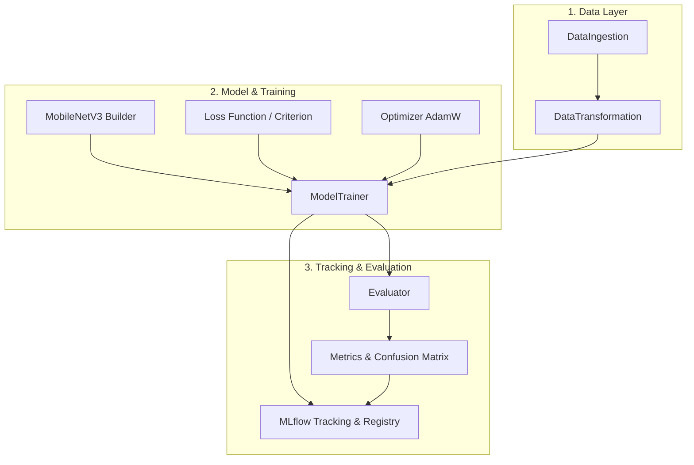

# Architecture & MLOps Lifecycle

RecycleNet follows a four-phase MLOps roadmap designed for robust, reproducible, and scalable production deployments.

---

## 🏗️ Architecture Overview

---

## 📐 SOLID Principles in RecycleNet

| Principle | Implementation in RecycleNet |
| :--- | :--- |
| **S - Single Responsibility** | Components are decoupled: `DataIngestion` extracts datasets, `DataTransformation` generates tensor pipelines, `ModelTrainer` executes optimization loops, and `LogModel` interacts with MLflow. |
| **O - Open/Closed** | Training pipelines and architectures are extensible without modifying existing orchestration logic. |
| **L - Liskov Substitution** | Custom dataset transformations and model wrappers seamlessly adhere to standard PyTorch interfaces (`Dataset`, `DataLoader`, `nn.Module`). |
| **I - Interface Segregation** | Fine-grained interfaces for metric calculation, data loading, and tracking rather than monolithic classes. |
| **D - Dependency Inversion** | High-level orchestrators (`TrainPipeline`) receive configurations and abstractions via dependency injection rather than hardcoded global values. |

---

## 🗺️ Project Roadmap Phases

1. **Phase 1: Local Training & MLflow Tracking** (Current)
   * Transfer Learning on MobileNetV3-Small.
   * Reproducible DataLoaders and augmentations.
   * SQLite-backed MLflow run tracking and model signature registry.
2. **Phase 2: FastAPI & Containerization**
   * Low-latency REST inference endpoint.
   * Docker multi-stage build.
3. **Phase 3: Testing & Kubernetes**
   * Pytest unit and integration test suite.
   * Local deployment simulation on Minikube / Kubernetes manifests.
4. **Phase 4: CI/CD & GCP Cloud Run**
   * GitHub Actions workflow.
   * Google Artifact Registry and serverless Cloud Run deployment.
